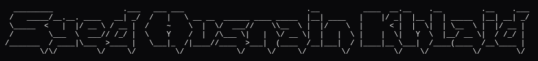

### Full-Stack & Systems Infrastructure · DevEx / Distributed Systems

I build reliable backend systems, developer tooling, and distributed cloud infrastructure: SDKs, asynchronous pipelines, event-driven microservices, and client-server integrations across the web and mobile ecosystem.

My focus is **system correctness & developer experience**: debugging complex integration lifecycles, eliminating race conditions, building deterministic testing harnesses, and ensuring client SDKs talk flawlessly to backend services.

---

### What I'm focused on now

Bridging client-side developer experience (Expo / React Native, TypeScript, webhooks) with mission-critical backend execution: offline-first distributed synchronization, robust state machines, automated CI/CD security pipelines, and high-throughput API architectures.

---

### Engineering & Systems Background

- **2,956+ contributions in the past year** across developer tooling, backend infrastructure, and cloud systems
- **CASA Tier 2 & OWASP ASVS v4.0** security specification author (9.7 TAC Security ESOF score)
- Engineered high-stakes platforms: offline-first intercity transit systems, concurrent examination engines, and automated AI workflow pipelines
- Specialty: Distributed state machines, SDK & API integration debugging, asynchronous task queues (Celery/Redis), and Linux/cloud platforms (GCP, AWS, Hetzner)

---

### Featured Open Source & Projects

- **[Infra-Guard](https://github.com/DevHusnainAi/infra-guard)** - Automated cloud infrastructure security and deployment baseline policy enforcement engine.
- **[OWASP OpenCRE](https://github.com/OWASP/OpenCRE/pull/984)** - Contributed frontend E2E migration to Cypress for the OWASP OpenCRE security framework ([PR #984](https://github.com/OWASP/OpenCRE/pull/984)).

---

### Engineering philosophy

Developer-facing infrastructure cannot afford black-box assumptions. When an SDK fails, a webhook drops, or a network link severs, the system must fail gracefully and tell the developer *why*. Building software that developers trust requires deterministic lifecycles, rigorous network tracing, idempotent operations, and zero tolerance for silent failures.

---

### Tech stack

  
   
   
  

    
    
    
    
    
  

---

### Contact

Available for full-time US-overlap engineering roles in Developer Experience, Support Engineering, and Full-Stack/Systems.

📧 [Email Me](mailto:syedhussnaintirmizi@gmail.com)  
💼 [LinkedIn](https://linkedin.com)  
🐙 [GitHub](https://github.com/DevHusnainAi)
